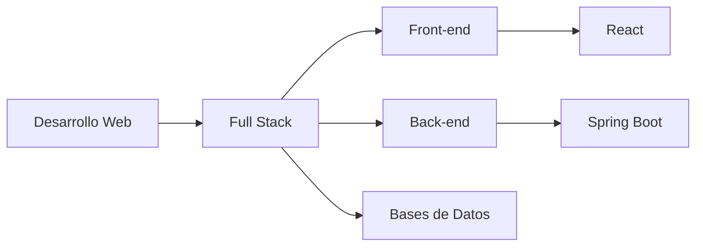

<div align="center">
  
# Iván Roldán | Full Stack Developer 

[](https://git.io/typing-svg)

[](https://github.com/tuUsuario)
[](https://instagram.com/iivan_rld)
[](https://linkedin.com/in/tuUsuario)

</div>


## 👨‍💻 Sobre mí

¡Hola! 👋 Soy **Iván**, un desarrollador Full Stack apasionado por crear experiencias web únicas y memorables. Mi objetivo es transformar ideas innovadoras en soluciones digitales que marquen la diferencia.

```javascript
const ivan = {
    ubicación: "Madrid, España",
    rol: "Full Stack Developer",
    educación: "Desarrollo de Aplicaciones Multiplataforma",
    código: ["JavaScript", "Java", "Python", "HTML", "CSS"],
    tecnologías: {
        frontEnd: {
            js: ["React", "Vite"],
            css: ["Tailwind", "Bootstrap", "SASS"]
        },
        backEnd: {
            java: ["Spring Boot"],
            js: ["Node.js", "Express"]
        },
        databases: ["MySQL", "MongoDB", "PostgreSQL"],
        tools: ["Git", "Docker", "VS Code", "Power BI"]
    },
    desafíoActual: "Mejorando mis habilidades en desarrollo web y análisis de datos"
};
```

<details>
<summary>🎯 Objetivos 2024</summary>
<br>

- 📚 Dominar Spring Boot y React
- 🌟 Contribuir a proyectos open source
- 📊 Especializarme en visualización de datos
- 🚀 Desarrollar aplicaciones web innovadoras

</details>

## 🛠️ Stack Tecnológico

<div align="center">

[](https://skillicons.dev)

</div>

## 📊 Estadísticas GitHub

<div align="center">
  
 <br><br>
  
 

</div>

## 🚀 Proyectos Destacados

<div align="center">

[](https://github.com/tuUsuario/TripGenius)
[](https://github.com/tuUsuario/RickandMortyAPI_proyect)

</div>

## 💼 Experiencia



## 📫 Contacto

<div align="center">
  
[](mailto:ivanrld.02@gmail.com)
[](https://instagram.com/iivan_rld)
[](https://linkedin.com/in/tuUsuario)

</div>

---

<div align="center">
  
### 👀 Visitas al Perfil


</div>
