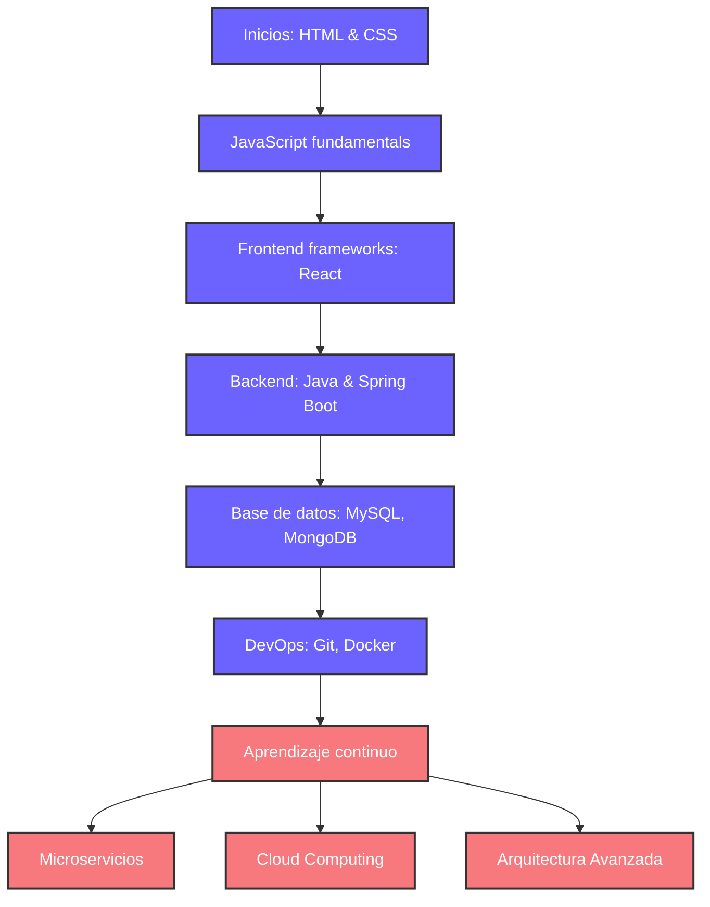

<div align="center">
  

  <!-- Matrix rain -->
  
</div>

<div align="center">
  <!-- Typing SVG -->
  <a href="https://github.com/iivanrld">
    
  </a>
</div>

<!-- Separador animado -->


##  <b>Sobre mí</b>

```javascript
// developer.js - Un vistazo a mi perfil profesional
const ivan = {
    code: ["JavaScript", "Java", "PHP", "Python", "HTML/CSS"],
    askMeAbout: ["desarrollo web", "arquitectura frontend", "APIs RESTful", "café ☕"],
    technologies: {
        frontEnd: {
            js: ["React", "VanillaJS"],
            css: ["Bootstrap", "Tailwind", "Responsive Design"]
        },
        backEnd: {
            java: ["Spring Boot", "JPA/Hibernate"],
            js: ["Node.js", "Express"],
            php: ["Laravel", "Vanilla"]
        },
        databases: ["MySQL", "MongoDB"],
        tools: ["Git", "Docker", "VS Code", "Postman"]
    },
    currentlyLearning: ["Microservicios", "DevOps", "AWS"],
    funFact: "El código es como un chiste, si tienes que explicarlo, es malo 😂"
};
```

<div align="center">
  
</div>

<!-- Separador -->


##  <b>Tecnologías & Herramientas</b>

<div align="center">
  <!-- Tecnologías Frontend -->
  <h3>🌟 Frontend</h3>
  
  
  
  
  
  
  <!-- Tecnologías Backend -->
  <h3>⚙️ Backend</h3>
  
  
  
  
  
  
  <!-- Bases de datos -->
  <h3>🗃️ Bases de datos</h3>
  
  
  
  <!-- Herramientas -->
  <h3>🛠️ Herramientas</h3>
  
  
  
  
</div>

<!-- Separador -->


##  <b>Proyectos Destacados</b>

<div align="center">
  <table>
    <tr>
      <td width="50%">
        <h3 align="center">🌟 TripGenius</h3>
        <div align="center">
          <a href="https://github.com/iivanrld/TripGenius" target="_blank">
            
          </a>
          <p>
            <a href="https://github.com/iivanrld/TripGenius" target="_blank">
              
            </a>
          </p>
          <p><strong>Aplicación de viajes inteligente</strong> - Interfaz dinámica con JavaScript (49.9%), CSS (48.6%) y HTML (1.5%). Diseñada para ofrecer experiencias personalizadas de viaje.</p>
        </div>
      </td>
      <td width="50%">
        <h3 align="center">🌐 API Rick & Morty</h3>
        <div align="center">
          <a href="https://github.com/iivanrld/RickandMortyAPI_proyect" target="_blank">
            
          </a>
          <p>
            <a href="https://github.com/iivanrld/RickandMortyAPI_proyect" target="_blank">
              
            </a>
          </p>
          <p><strong>Visualizador de datos de la API de Rick & Morty</strong> - Integración con REST API utilizando HTML (62.8%) y JavaScript (33.2%). Implementación de interfaces dinámicas para mostrar información de personajes.</p>
        </div>
      </td>
    </tr>
    <tr>
      <td width="50%">
        <h3 align="center">💡 Proyecto Asesoría Energética</h3>
        <div align="center">
          <a href="https://github.com/iivanrld/Proyecto_consulta_bd_asesoria_energetica" target="_blank">
            
          </a>
          <p>
            <a href="https://github.com/iivanrld/Proyecto_consulta_bd_asesoria_energetica" target="_blank">
              
            </a>
          </p>
          <p><strong>Sistema de gestión energética</strong> - Aplicación web full-stack para consultas de base de datos y gestión energética. Enfoque en funcionalidad y visualización eficiente de datos.</p>
        </div>
      </td>
      <td width="50%">
        <h3 align="center">🏥 Clínica Salud Encuesta</h3>
        <div align="center">
          <a href="https://github.com/iivanrld/ClinicaSaludEncuesta" target="_blank">
            
          </a>
          <p>
            <a href="https://github.com/iivanrld/ClinicaSaludEncuesta" target="_blank">
              
            </a>
          </p>
          <p><strong>Sistema de encuestas para clínicas</strong> - Implementado en Python, permite recopilar y analizar datos de pacientes. Interfaz intuitiva y análisis estadístico incorporado.</p>
        </div>
      </td>
    </tr>
  </table>
</div>

<!-- Separador -->


##  <b>GitHub Analytics</b>

<div align="center">
  
  
</div>

<div align="center">
  
  <br/>
  <h4>"El código es poesía escrita en lógica."</h4>
</div>

<div align="center">
  
</div>

<!-- Separador -->


##  <b>Mi Ruta de Desarrollo</b>



<div align="center">
  <p><i>💡 Tip de desarrollador: "Escribe código como si la persona que lo mantendrá sea un psicópata violento que sabe dónde vives."</i></p>
</div>

<!-- Separador -->


##  <b>Contribuciones</b>

<div align="center">
  
  
  <br>
  <p>"Los programadores de hoy son los magos del mañana. 🧙‍♂️"</p>
  <br>
</div>

<!-- Separador -->


##  <b>Contacto</b>

<div align="center">
  <a href="https://instagram.com/iivan_rld" target="_blank">
    
  </a>
  <a href="mailto:ivanrld.02@gmail.com" target="_blank">
    
  </a>
  <a href="https://github.com/iivanrld" target="_blank">
    
  </a>
</div>

<div align="center">
  <h4>¿Quieres colaborar en un proyecto? ¡Contáctame! ☕</h4>
  <p>"El café es el combustible oficial de los desarrolladores. ☕" </p>
</div>

<!-- Contador de visitas -->
<div align="center">
  <h3>👁️ Visitas al Perfil</h3>
  
  
</div>

<div align="center">
  
</div>
